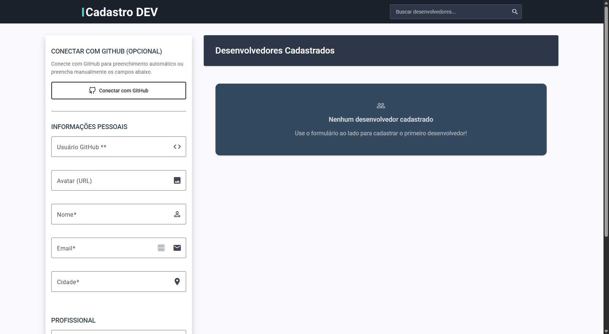

- 📄 [Currículo - Desenvolvedora Front-End](Gabriela%20Ceranto%20-%20Desenvolvedora%20Front-End%20I.pdf)

# 🚀 Dev Finder

Uma aplicação Angular para cadastro e busca de desenvolvedores com suas habilidades.

## ✨ Demo

**Acesse a aplicação:** [https://gaabiceranto.github.io/dev-finder/](https://gaabiceranto.github.io/dev-finder/)

## 🎯 Sobre o Projeto

O Dev Finder é uma plataforma que permite:

- **Cadastrar desenvolvedores** com suas informações e habilidades
- **Buscar desenvolvedores** cadastrados por tecnologias, formação acadêmica e cidade
- **Integração com GitHub** para autenticação e preenchimento automático de dados
- **Interface responsiva** e moderna

## 🛠️ Tecnologias

- **Angular 20** - Framework principal
- **NgRx** - Gerenciamento de estado
- **Angular Material** - Componentes UI
- **Firebase** - Autenticação com GitHub
- **GitHub API** - Integração para dados do usuário
- **SCSS** - Estilização avançada

## 🚀 Funcionalidades

### ✅ Implementadas

- [x] Formulário reativo para cadastro
- [x] Autenticação com GitHub via Firebase
- [x] Busca por habilidades e localização
- [x] Interface responsiva e moderna
- [x] Gerenciamento de estado com NgRx
- [x] Deploy automatizado no GitHub Pages

### 🎨 Interface

- Adaptações do design original do Figma para melhorar a experiência do usuário, incluindo ajustes de layout, componentes e interações
- Cards responsivos para exibição dos desenvolvedores
- Formulário com validações

## 📱 Screenshots

### Tela Principal



## 🚀 Como Executar

### Pré-requisitos

- Node.js (versão 18 ou superior)
- Angular CLI

### Instalação

```bash
# Clone o repositório
git clone https://github.com/gaabiceranto/dev-finder.git

# Entre na pasta
cd dev-finder

# Instale as dependências
npm install

# Execute em modo desenvolvimento
npm start
```

## 📁 Estrutura do Projeto

```
dev-finder/
├── projects/frontend/
│   ├── src/app/
│   │   ├── components/          # Componentes da aplicação
│   │   ├── services/           # Serviços (Firebase, GitHub API)
│   │   ├── store/              # Gerenciamento de estado (NgRx)
│   │   └── models/             # Interfaces e tipos
│   └── public/                 # Assets estáticos
├── angular.json               # Configuração Angular
└── package.json              # Dependências e scripts
```

## 🔧 Configurações

### Firebase

Para usar a autenticação com GitHub, configure suas credenciais do Firebase em `app.config.ts`.

### GitHub Pages

O projeto está configurado para deploy automático no GitHub Pages com:

- HashLocationStrategy para roteamento
- Base href configurado
- Scripts de deploy automatizados

## 👨‍💻 Autora

**Gabriela Ceranto**

- GitHub: [@gaabiceranto](https://github.com/gaabiceranto)
- 📄 [Currículo - Desenvolvedora Front-End I](Gabriela%20Ceranto%20-%20Desenvolvedora%20Front-End%20I.pdf)
